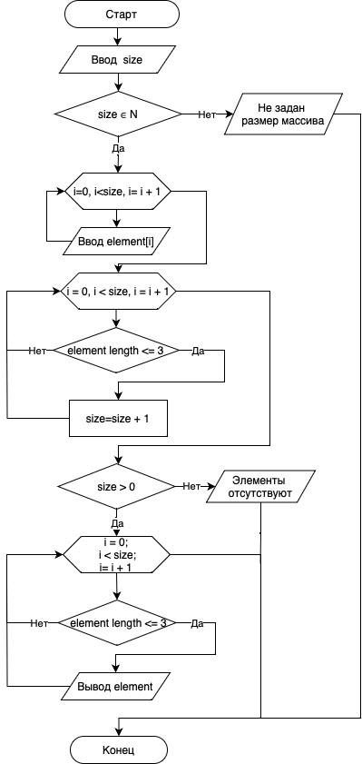

# Блок-схема решения поставленной задачи
***Задача: Написать программу, которая из имеющегося массива строк формирует новый массив из строк, длина которых меньше, либо равна 3 символам. Первоначальный массив можно ввести с клавиатуры, либо задать на старте выполнения алгоритма. При решении не рекомендуется пользоваться коллекциями, лучше обойтись исключительно массивами.***

Примеры:

[“Hello”, “2”, “world”, “:-)”] → [“2”, “:-)”]

[“1234”, “1567”, “-2”, “computer science”] → [“-2”]

[“Russia”, “Denmark”, “Kazan”] → []*

### Пояснения к блок-схеме

1. Начало алгоритма
2. Ввод пользователем переменной size, которая определяет количество элементов в массиве.
3. В логическом блоке (ромб) проводится проверка значения переменной size, так как переменная может принимать значение только натуральных чисел. При вводе пользователем любого другого значения или пустой строки будет программа будет завершена с выводом ошибки "Не задан размер массива".
3. Далее пользователь с помощью блока организации циклического процесса (счётчик) вводит поочерёдно значение элементов массива.
4. В следующем блоке счётчике проверяется количество элементов массива соответствующих поставленному условию т.е. количество символов в элементе не должно превышать 3.
5. В блоке условие size > 0, если в массиве отстствуют элементы подходящие под условие задания, если таких элементов нет будет выведено сообщение "Элементы отсутствуют" и программа будет завершена.
6. В последнем блоке счётчики мы пробегаемся заново  по всему массиву, а блок условие выводит на печать все элементы массива содержащие 3 или менее символов.